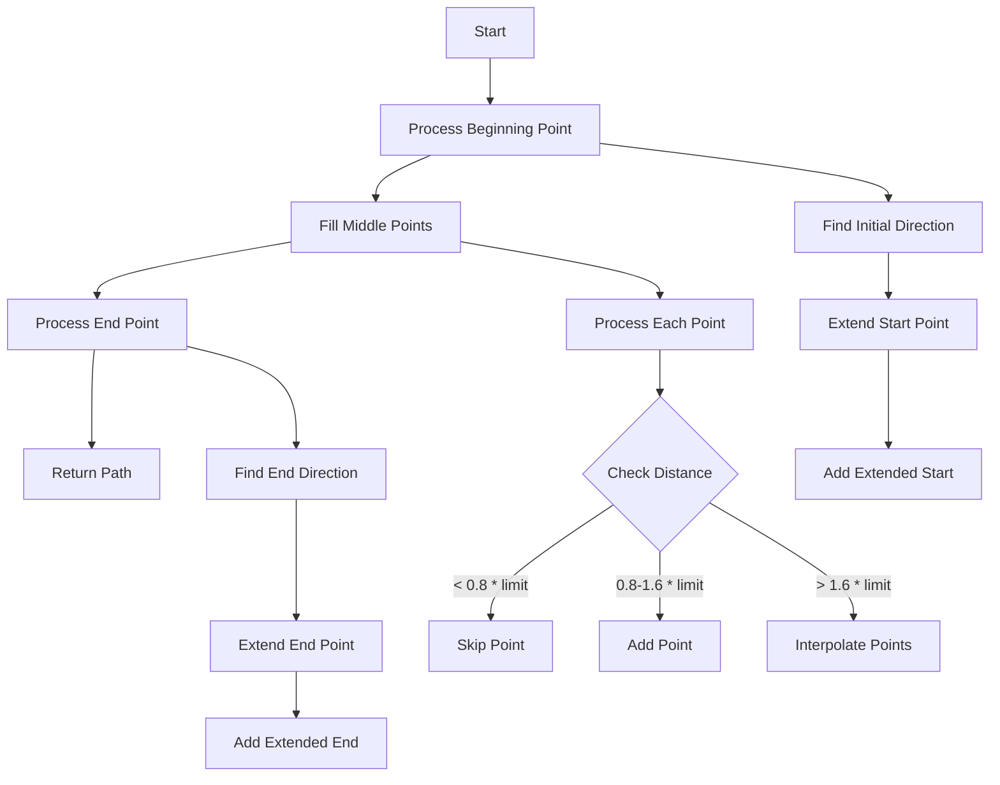
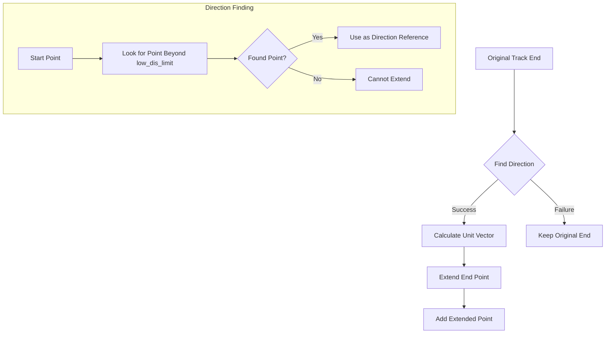

# Understanding organize_wcps_path() Function

## Purpose
The `organize_wcps_path()` function is designed to organize and resample a collection of 3D points that make up a track path. It takes a list of Wire Cell Points (WCPoints) and produces a more uniformly sampled path with consistent point spacing and extended endpoints.

## Key Parameters
- `path_wcps_list`: Input list of WCPoints representing the original path
- `low_dis_limit`: Minimum distance between points in the resampled path 
- `end_point_limit`: How far to extend the endpoints beyond the last points
- Returns a `PointVector` containing the resampled path points

## Function Flow


## Key Steps

1. **Beginning Point Processing**:
```cpp
// Get initial direction vector
Point p1(temp_wcps_vec.front().x, temp_wcps_vec.front().y, temp_wcps_vec.front().z);
Point p2(temp_wcps_vec.front().x, temp_wcps_vec.front().y, temp_wcps_vec.front().z);
double dis1 = 0;

// Find direction by looking ahead until significant distance found
for (auto it = temp_wcps_vec.begin(); it!=temp_wcps_vec.end(); it++){
    p2.x = (*it).x;
    p2.y = (*it).y;
    p2.z = (*it).z;
    dis1 = sqrt(pow(p1.x-p2.x,2)+pow(p1.y-p2.y,2)+pow(p1.z-p2.z,2));
    if (dis1 > low_dis_limit) break;
}

// Extend start point if valid direction found
if (dis1!=0){
    p1.x += (p1.x - p2.x)/dis1 * end_point_limit;
    p1.y += (p1.y - p2.y)/dis1 * end_point_limit;
    p1.z += (p1.z - p2.z)/dis1 * end_point_limit;
    pts.push_back(p1);
}
```

2. **Middle Points Processing**:
```cpp
// For each point
for (size_t i=0;i!=temp_wcps_vec.size(); i++){
    Point p1(temp_wcps_vec.at(i).x, temp_wcps_vec.at(i).y, temp_wcps_vec.at(i).z);
    double dis = sqrt(pow(p1.x-pts.back().x,2)+pow(p1.y-pts.back().y,2)+pow(p1.z-pts.back().z,2));

    // Skip if too close
    if (dis < low_dis_limit * 0.8){
        continue;
    }
    // Add point if reasonable distance
    else if (dis < low_dis_limit * 1.6){
        pts.push_back(p1);
    }
    // Interpolate points if gap too large
    else {
        int npoints = std::round(dis/low_dis_limit);
        Point p_save = pts.back();
        for (int j=0;j!=npoints;j++){
            Point p(p_save.x + (p1.x-p_save.x) / npoints * (j+1),
                   p_save.y + (p1.y-p_save.y) / npoints * (j+1),
                   p_save.z + (p1.z-p_save.z) / npoints * (j+1));
            pts.push_back(p);
        }
    }
}
```

3. **End Point Processing**:
```cpp
Point p1(temp_wcps_vec.back().x, temp_wcps_vec.back().y, temp_wcps_vec.back().z);
Point p2(temp_wcps_vec.back().x, temp_wcps_vec.back().y, temp_wcps_vec.back().z);
double dis1 = 0;

// Find direction looking backward
for (auto it = temp_wcps_vec.rbegin(); it!=temp_wcps_vec.rend(); it++){
    p2.x = (*it).x;
    p2.y = (*it).y;
    p2.z = (*it).z;
    dis1 = sqrt(pow(p1.x-p2.x,2)+pow(p1.y-p2.y,2)+pow(p1.z-p2.z,2));
    if (dis1 > low_dis_limit) break;
}

// Extend end point
if (dis1!=0){
    p1.x += (p1.x - p2.x)/dis1 * end_point_limit;
    p1.y += (p1.y - p2.y)/dis1 * end_point_limit;
    p1.z += (p1.z - p2.z)/dis1 * end_point_limit;
    pts.push_back(p1);
}
```

## Called Functions

The function uses several math and utility functions:

1. `sqrt()` - Square root calculation
2. `pow()` - Power/exponent calculation 
3. `round()` - Rounding to nearest integer
4. `push_back()` - Vector addition

## Important Details

1. **Point Spacing**:
   - Points too close (< 0.8 * limit) are skipped
   - Points at reasonable distance (0.8-1.6 * limit) are kept
   - Large gaps (> 1.6 * limit) are filled with interpolated points

2. **Endpoint Extension**:
   - Path is extended at both ends by `end_point_limit` distance
   - Extension direction is determined by nearby points
   - Only extends if valid direction can be determined

3. **Error Handling**:
   - Checks for zero distances to avoid division by zero
   - Handles cases where no valid direction can be found
   - Falls back to original points if needed

## Example Usage

```cpp
// Create input path
std::list<WCP::WCPointCloud<double>::WCPoint> path_wcps_list;
// ... add points to path_wcps_list ...

// Set parameters
double low_dis_limit = 1.2 * units::cm;  // Minimum spacing
double end_point_limit = 0.6 * units::cm; // Extension length

// Process path
WCP::PointVector processed_path = organize_wcps_path(ct_point_cloud, 
                                                    path_wcps_list,
                                                    low_dis_limit, 
                                                    end_point_limit);
```

This function is particularly useful in particle tracking applications where you want to:
- Ensure consistent point spacing along tracks
- Extend tracks slightly beyond their detected endpoints
- Remove unnecessarily dense point clusters
- Fill large gaps with interpolated points


# Understanding Endpoint Extension Logic

## Overview

The endpoint extension logic in `organize_wcps_path()` serves to extend track endpoints beyond their last measured points. This is important for:
1. Compensating for detector edge effects
2. Ensuring complete track reconstruction
3. Providing better track length estimates

## Extension Algorithm

### Start Point Extension

```cpp
// Starting point handling
{
    Point p1(temp_wcps_vec.front().x, temp_wcps_vec.front().y, temp_wcps_vec.front().z);
    Point p2(temp_wcps_vec.front().x, temp_wcps_vec.front().y, temp_wcps_vec.front().z);
    double dis1 = 0;

    // Look forward until we find a point far enough away to establish direction
    for (auto it = temp_wcps_vec.begin(); it!=temp_wcps_vec.end(); it++){
        p2.x = (*it).x;
        p2.y = (*it).y;
        p2.z = (*it).z;
        dis1 = sqrt(pow(p1.x-p2.x,2)+pow(p1.y-p2.y,2)+pow(p1.z-p2.z,2));
        if (dis1 > low_dis_limit) break;
    }

    // Only extend if we found a valid direction vector
    if (dis1!=0){
        // Calculate extended point by moving opposite to direction vector
        p1.x += (p1.x - p2.x)/dis1 * end_point_limit;  // Move in x
        p1.y += (p1.y - p2.y)/dis1 * end_point_limit;  // Move in y
        p1.z += (p1.z - p2.z)/dis1 * end_point_limit;  // Move in z
        pts.push_back(p1);  // Add extended point
    }
}
```

### End Point Extension

```cpp
// End point handling
{
    Point p1(temp_wcps_vec.back().x, temp_wcps_vec.back().y, temp_wcps_vec.back().z);
    Point p2(temp_wcps_vec.back().x, temp_wcps_vec.back().y, temp_wcps_vec.back().z);
    double dis1 = 0;

    // Look backward until we find a point far enough away to establish direction
    for (auto it = temp_wcps_vec.rbegin(); it!=temp_wcps_vec.rend(); it++){
        p2.x = (*it).x;
        p2.y = (*it).y;
        p2.z = (*it).z;
        dis1 = sqrt(pow(p1.x-p2.x,2)+pow(p1.y-p2.y,2)+pow(p1.z-p2.z,2));
        if (dis1 > low_dis_limit) break;
    }

    // Only extend if we found a valid direction vector
    if (dis1!=0){
        // Calculate extended point by moving along direction vector
        p1.x += (p1.x - p2.x)/dis1 * end_point_limit;
        p1.y += (p1.y - p2.y)/dis1 * end_point_limit;
        p1.z += (p1.z - p2.z)/dis1 * end_point_limit;
        pts.push_back(p1);
    }
}
```

## Visual Representation



## Key Concepts

1. **Direction Finding**
   - The algorithm needs to establish a reliable direction at the endpoint
   - It searches for points beyond `low_dis_limit` to avoid using noise
   - Direction is only considered valid if a point is found beyond minimum distance

2. **Unit Vector Calculation**
   ```cpp
   // Convert direction to unit vector by dividing by distance
   double dx = (p1.x - p2.x)/dis1;  // x component
   double dy = (p1.y - p2.y)/dis1;  // y component
   double dz = (p1.z - p2.z)/dis1;  // z component
   ```

3. **Extension Distance**
   - The `end_point_limit` parameter controls extension length
   - Extension uses the unit vector multiplied by this distance
   - This creates a consistent extension regardless of original point spacing

4. **Safety Checks**
   - Extension only happens if a valid direction is found (dis1 != 0)
   - The direction search has a limit to avoid using distant, potentially unrelated points
   - The algorithm handles both start and end points independently

## Example Scenarios

### Case 1: Clean Track End
```
Original points:  *  *  *  *  *
After extension: *  *  *  *  *  +
```
- Points are well-spaced
- Clear direction found
- Extension is straightforward

### Case 2: Noisy Track End
```
Original points:  *  *  * * **
After extension: *  *  * * ** +
```
- Multiple close points at end
- Algorithm looks past noise to find direction
- Extension based on overall track direction

### Case 3: No Extension
```
Original points:  *  *  **
After extension: *  *  **
```
- No points beyond `low_dis_limit`
- Cannot establish reliable direction
- Original endpoint kept

## Important Considerations

1. **Extension Length**
   - `end_point_limit` should be chosen based on detector properties
   - Too long: May extend into unrelated regions
   - Too short: May not fully compensate for edge effects

2. **Direction Finding**
   - Uses `low_dis_limit` to ensure reliable direction
   - Ignores very close points that might be noise
   - Searches until finding a point far enough away

3. **Error Cases**
   - Handles cases where no valid direction can be found
   - Preserves original endpoints when extension isn't possible
   - Avoids division by zero through distance checks

4. **Coordinate System**
   - Extension happens in 3D space
   - Each coordinate (x,y,z) is extended proportionally
   - Maintains the track's original direction

The endpoint extension logic is crucial for ensuring tracks are properly reconstructed, especially near detector boundaries or in noisy regions. The algorithm balances the need for extension with safety checks to prevent invalid extensions.