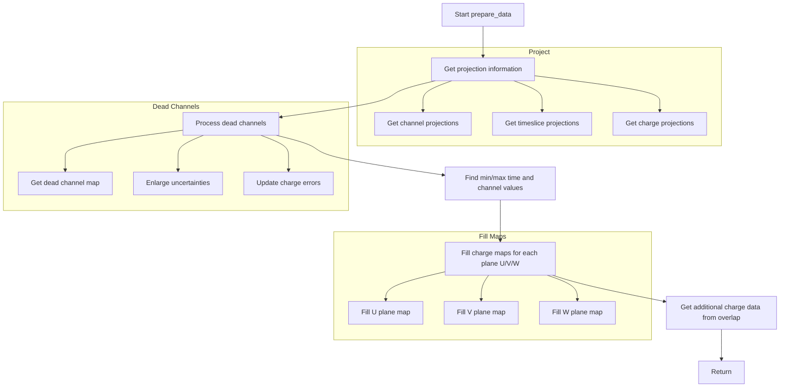

# PR3DCluster prepare_data() Function Documentation

## Overview
The `prepare_data()` function is responsible for preparing 2D charge data for track reconstruction in the PR3DCluster class. It processes wire charge data and organizes it into maps that associate time slices and channels with charge measurements.

## Function Signature
```cpp
void WCPPID::PR3DCluster::prepare_data(
    WCP::ToyCTPointCloud& ct_point_cloud,
    std::map<int,std::map<const WCP::GeomWire*, WCP::SMGCSelection > >& global_wc_map,
    std::map<std::pair<int,int>,std::tuple<double,double, int> >& map_2D_ut_charge,
    std::map<std::pair<int,int>,std::tuple<double,double, int> >& map_2D_vt_charge,
    std::map<std::pair<int,int>,std::tuple<double,double, int> >& map_2D_wt_charge
)
```

## Flow Diagram


## Key Components

### 1. Vector Initialization
The function initializes several vectors to store projection information:
```cpp
std::vector<int> proj_channel;
std::vector<int> proj_timeslice;
std::vector<int> proj_charge;
std::vector<int> proj_charge_err;
std::vector<int> proj_flag;
```

### 2. Getting Projection Data
It calls `get_projection()` to fill these vectors:
```cpp
get_projection(proj_channel, proj_timeslice, proj_charge, 
               proj_charge_err, proj_flag, global_wc_map);
```

### 3. Dead Channel Processing
```cpp
std::map<int, std::pair<int, int> > map_dead_chs = ct_point_cloud.get_all_dead_chs();
float factor_enlarge_ind = 5;
float factor_enlarge_col = 2.5;

// Process each channel
for (size_t i=0; i!=proj_channel.size(); i++) {
    int ch = proj_channel.at(i);
    int time = proj_timeslice.at(i);
    
    // Check if channel is dead and update uncertainties
    if (proj_charge.at(i)<=0) continue;
    
    bool flag_cur_dead = false;
    auto it1 = map_dead_chs.find(ch);
    if (it1!=map_dead_chs.end()) {
        if (time >= it1->second.first && time <= it1->second.second)
            flag_cur_dead = true;
    }
    // ... more dead channel processing
}
```

### 4. Charge Map Population
```cpp
// Example for U plane charges
if (proj_channel.at(i)<2400){
    map_2D_ut_charge[std::make_pair(proj_channel.at(i),proj_timeslice.at(i))] = 
        std::make_tuple(proj_charge.at(i), proj_charge_err.at(i), proj_flag.at(i));
        
    if (min_uch > proj_channel.at(i)) min_uch = proj_channel.at(i);
    if (max_uch < proj_channel.at(i)) max_uch = proj_channel.at(i);
}
```

## Function Calls
The prepare_data() function makes the following function calls:

1. `get_projection()`  [more details](./get_projection.md)
   - Retrieves projection information for channels, timeslices, and charges

2. `ct_point_cloud.get_all_dead_chs()`
   - Gets mapping of dead channels from point cloud

3. `ct_point_cloud.get_overlap_good_ch_charge()`
   - Gets charge information for overlapping good channels

4. `map_2D_ut_charge.find()`
   - Searches U plane charge map

5. `map_2D_vt_charge.find()`
   - Searches V plane charge map

6. `map_2D_wt_charge.find()`
   - Searches W plane charge map

## Data Structures
The function works with several key data structures:

1. Charge Maps
```cpp
// Maps (timeslice,channel) pairs to (charge,charge_err,flag) tuples
std::map<std::pair<int,int>,std::tuple<double,double,int>> map_2D_ut_charge; // U plane
std::map<std::pair<int,int>,std::tuple<double,double,int>> map_2D_vt_charge; // V plane 
std::map<std::pair<int,int>,std::tuple<double,double,int>> map_2D_wt_charge; // W plane
```

2. Wire-Cell Map
```cpp
// Maps timeslices to wire-cell selections
std::map<int,std::map<const WCP::GeomWire*, WCP::SMGCSelection>> global_wc_map;
```

3. Dead Channel Map
```cpp
// Maps channel numbers to time range pairs
std::map<int, std::pair<int, int>> map_dead_chs;
```

## Flag Values
The charge maps use flags to indicate the status of channels:
- 0: Dead channel
- 1: Good channel or overlapping channel
- 2: Isolated channel  
- 3: Additional channel from overlap processing

## Usage Example
Here's an example of how the function might be used:

```cpp
// Create necessary objects
WCP::ToyCTPointCloud ct_point_cloud;
std::map<int,std::map<const WCP::GeomWire*, WCP::SMGCSelection>> global_wc_map;
std::map<std::pair<int,int>,std::tuple<double,double,int>> map_2D_ut_charge;
std::map<std::pair<int,int>,std::tuple<double,double,int>> map_2D_vt_charge;
std::map<std::pair<int,int>,std::tuple<double,double,int>> map_2D_wt_charge;

// Call prepare_data
pr3d_cluster.prepare_data(
    ct_point_cloud,
    global_wc_map,
    map_2D_ut_charge,
    map_2D_vt_charge,
    map_2D_wt_charge
);

// Access prepared data
for(auto& charge_data : map_2D_ut_charge) {
    int timeslice = charge_data.first.first;
    int channel = charge_data.first.second;
    double charge = std::get<0>(charge_data.second);
    double charge_err = std::get<1>(charge_data.second);
    int flag = std::get<2>(charge_data.second);
    
    // Process charge data...
}
```