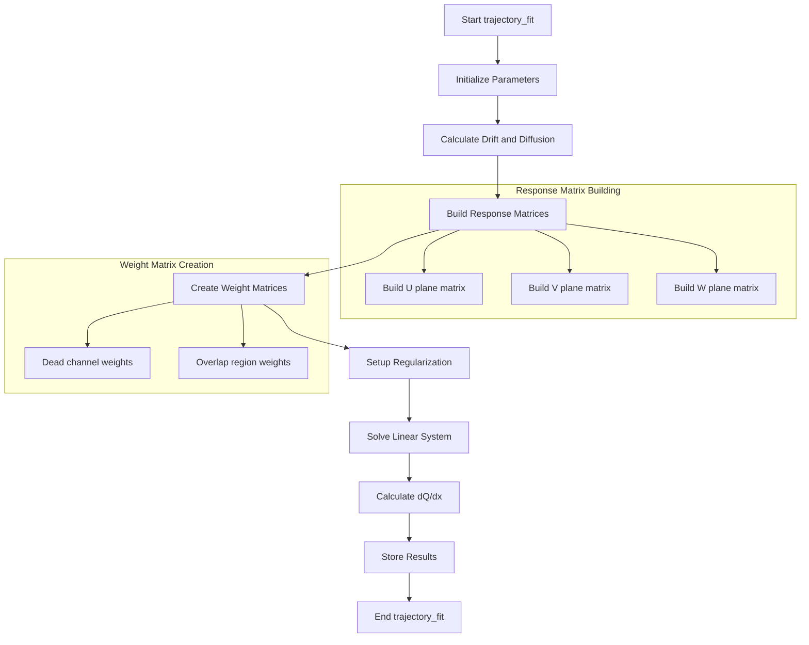
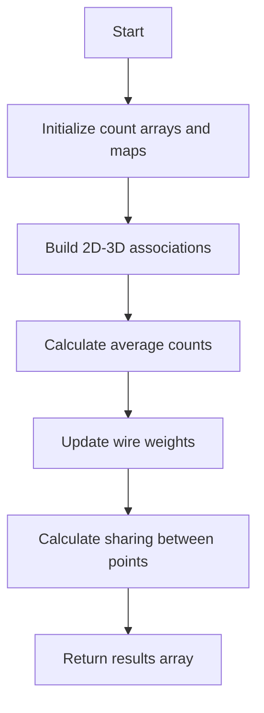

# Trajectory Fitting Function Analysis

## Overview
The `trajectory_fit` function performs 3D track reconstruction by fitting trajectory points using charge measurements from multiple wire planes (U, V, W) in a time projection chamber (TPC). It uses a mathematical framework to optimize the 3D positions based on 2D projections and charge measurements.



## Key Components

### 1. Input Parameters
- Point vector (3D trajectory points)
- 2D charge measurements maps
- Wire geometry information
- Time slice information
- Various detector parameters

### 2. Main Function Calls

The function makes calls to several helper functions:

```cpp
// Calculate Gaussian integral for charge sharing
double cal_gaus_integral(int tbin, int wbin, double t_center, double t_sigma, 
                        double w_center, double w_sigma, int flag, double nsigma);

// Calculate segmented Gaussian integrals
double cal_gaus_integral_seg(int tbin, int wbin, std::vector<double>& t_centers,
                           std::vector<double>& t_sigmas, std::vector<double>& w_centers, 
                           std::vector<double>& w_sigmas, std::vector<double>& weights, 
                           int flag, double nsigma);
```
see [more details](./cal_gaus_integral.md)

```cpp

// Calculate compact matrices for regularization
std::vector<std::pair<double, double>> cal_compact_matrix(Eigen::SparseMatrix<double>& MW, 
                                                         Eigen::SparseMatrix<double>& RWT, 
                                                         int n_2D_w, int n_3D_pos, 
                                                         double cut_pos);
```

## Implementation Details

### 1. Parameter Initialization
```cpp
// TPC parameters initialization
TPCParams& mp = Singleton<TPCParams>::Instance();
double pitch_u = mp.get_pitch_u();
double pitch_v = mp.get_pitch_v();
double pitch_w = mp.get_pitch_w();
double angle_u = mp.get_angle_u();
double angle_v = mp.get_angle_v();
double angle_w = mp.get_angle_w();
```

### 2. Response Matrix Construction
The function builds response matrices for each wire plane:

```cpp
Eigen::SparseMatrix<double> RU(n_2D_u, n_3D_pos);
Eigen::SparseMatrix<double> RV(n_2D_v, n_3D_pos);
Eigen::SparseMatrix<double> RW(n_2D_w, n_3D_pos);

// For each trajectory point
for (int i=0; i!=n_3D_pos; i++) {
    // Calculate expected charge response on each plane
    // Fill response matrices
}
```

### 3. Weight Matrix Creation
Different weights are applied based on:
- Dead channels
- Charge overlap regions
- Plane-specific uncertainties

```cpp
// Example weight calculation
double dead_ind_weight = 0.3;
double dead_col_weight = 0.9;
double close_ind_weight = 0.15;
double close_col_weight = 0.45;
```

### 4. Linear System Solution
The function solves a linear system to optimize the 3D positions:

```cpp
Eigen::BiCGSTAB<Eigen::SparseMatrix<double>> solver;
Eigen::VectorXd b = RUT * MU * data_u_2D + RVT * MV * data_v_2D + RWT * MW * data_w_2D;
Eigen::SparseMatrix<double> A = RUT * MU * RU + RVT * MV * RV + RWT * MW * RW + FMatrixT * FMatrix;
solver.compute(A);
pos_3D = solver.solveWithGuess(b, pos_3D_init);
```

## Outputs
The function produces:
- Optimized 3D positions
- dQ/dx measurements
- Quality metrics (reduced chi-square)
- Projection maps for each plane

## Technical Details

### Charge Diffusion Handling
The function accounts for charge diffusion effects:
```cpp
double DL = 6.4 * pow(units::cm,2)/units::second; // Longitudinal diffusion
double DT = 9.8 * pow(units::cm,2)/units::second; // Transverse diffusion

// Calculate diffusion sigmas
double diff_sigma_L = sqrt(2* DL * drift_time);
double diff_sigma_T = sqrt(2* DT * drift_time);
```

### Regularization
The function applies regularization to handle:
- Dead channels
- Noise
- Track smoothness
```cpp
double lambda = 0.0005; // Regularization strength
FMatrix *= lambda;
if (!flag_dQ_dx_fit_reg)
    FMatrix *= 0.01;
```

### Uncertainty Handling
Different uncertainties are considered:
```cpp
double rel_uncer_ind = 0.075;  // Induction plane uncertainty
double rel_uncer_col = 0.05;   // Collection plane uncertainty
double add_uncer_ind = 0.0;    // Additional induction uncertainty
double add_uncer_col = 300.0;  // Additional collection uncertainty
```

## Performance Considerations
- Uses sparse matrices for efficient memory usage
- Employs BiCGSTAB solver for large linear systems
- Includes fallback solutions when solver fails
- Handles edge cases with regularization

## Post-Processing: Trajectory Point Skipping

After solving for the 3D positions, the function employs a trajectory point skipping mechanism through the `skip_trajectory_point` function to improve trajectory quality.

### Skip Trajectory Logic
The function evaluates whether specific trajectory points should be skipped based on several criteria:

```cpp
bool skip_trajectory_point(WCP::Point& p, int i, int index, 
    WCP::PointVector& ps_vec,
    std::map<int, std::pair<std::set<std::pair<int,int>>, float> >& map_3D_2DU_set,
    // ... other parameters ...
    double offset_t, double slope_x, double offset_u, double slope_yu, double slope_zu)
```

### Key Evaluation Criteria

1. **Charge Comparison**
```cpp
// Compare charges in U, V, W planes
double c1_u = 0, c2_u = 0;  // U plane charges
double c1_v = 0, c2_v = 0;  // V plane charges
double c1_w = 0, c2_w = 0;  // W plane charges

// Calculate ratio between original and fitted charges
double ratio = (c1_u/c2_u + c1_v/c2_v + c1_w/c2_w)/3.0;
double ratio_1 = (c1_u/c2_u) * (c1_v/c2_v) * (c1_w/c2_w);
```

2. **Angle Analysis**
```cpp
// Examine angles between consecutive segments
TVector3 v1(fine_tracking_path.at(size-1).x - fine_tracking_path.at(size-2).x,
           fine_tracking_path.at(size-1).y - fine_tracking_path.at(size-2).y,
           fine_tracking_path.at(size-1).z - fine_tracking_path.at(size-2).z);
TVector3 v2(p.x - fine_tracking_path.at(size-1).x,
           p.y - fine_tracking_path.at(size-1).y,
           p.z - fine_tracking_path.at(size-1).z);
double angle = v1.Angle(v2)/3.1415926*180.;
```

### Skip Conditions
Points are skipped if they meet any of these conditions:

1. **Charge Ratio Condition**
```cpp
if (ratio/3.0 < 0.97 || ratio_1 < 0.75) {
    return true;
}
```

2. **Angle Conditions**
```cpp
// Complete fold back
if (angle > 160 || angle > angle1 + 90) {
    return true;
}

// Dead channel related
if (angle > 45 && ((map_3D_2DU_set[index].second==0 && 
                    map_3D_2DV_set[index].second==0) ||
                   (map_3D_2DU_set[index].second==0 && 
                    map_3D_2DW_set[index].second==0) ||
                   (map_3D_2DV_set[index].second==0 && 
                    map_3D_2DW_set[index].second==0))) {
    return true;
}
```

3. **End Point Protection**
```cpp
// Protect against problematic end points
if (i+1==ps_vec.size() && angle > 45 && v2.Mag() < 0.5*units::cm) {
    return true;
}
```

### Impact on Trajectory
The skipping mechanism helps to:
- Remove unphysical kinks in the trajectory
- Handle regions with dead channels
- Improve trajectory quality near endpoints
- Ensure smooth transitions between segments

### Post-Skip Processing
After skipping evaluation:
1. Remaining points form the final trajectory
2. dQ/dx calculations are performed on valid points
3. Projection maps are updated accordingly

This mechanism is crucial for producing physically reasonable trajectories while handling detector effects and uncertainties.

# Understanding cal_compact_matrix() Function

## Purpose
The `cal_compact_matrix()` function is used to analyze the relationship between 2D wire planes and 3D points in wire chamber detector data. It helps identify overlapping regions and calculates weights for wire responses.

## Key Parameters
- `MW`: Sparse matrix for wire plane weights
- `RWT`: Transpose of the response matrix that maps 3D points to 2D wire signals
- `n_2D_w`: Number of 2D wires
- `n_3D_pos`: Number of 3D points
- `cut_pos`: Threshold for position cuts

## Flow Diagram


## Main Steps:

1. **Initialize Data Structures**
```cpp
std::vector<int> count_2D(n_2D_w, 1);
std::map<int, std::set<int>> map_2D_3D;  // Maps 2D wire to 3D points
std::map<int, std::set<int>> map_3D_2D;  // Maps 3D point to 2D wires
std::map<std::pair<int,int>, double> map_pair_val; // Stores matrix values
```

2. **Build Associations**
```cpp
// Loop through response matrix
for (int k=0; k<RWT.outerSize(); ++k) {
    for (Eigen::SparseMatrix<double>::InnerIterator it(RWT,k); it; ++it) {
        // Build 2D to 3D mapping
        map_2D_3D[it.col()].insert(it.row());
        // Build 3D to 2D mapping
        map_3D_2D[it.row()].insert(it.col());
        // Store matrix values
        map_pair_val[std::make_pair(it.row(), it.col())] = it.value();
    }
}
```

3. **Calculate Average Counts**
Example of how points are weighted:
```cpp
// For each 3D point
for (auto it = map_3D_2D.begin(); it != map_3D_2D.end(); it++) {
    double sum1 = 0, sum2 = 0;
    int flag = 0;
    // Calculate weighted sums
    for (auto it1 = it->second.begin(); it1 != it->second.end(); it1++) {
        double val = map_pair_val[std::make_pair(it->first, *it1)];
        sum1 += count_2D[*it1] * val;
        sum2 += val;
    }
    ave_count[it->first] = std::make_pair(sum1/sum2, flag);
}
```

4. **Calculate Point Sharing**
The function calculates how much each 3D point shares signal with its neighbors:
```cpp
std::vector<std::pair<double,double>> results(n_3D_pos);
for (auto it = map_3D_2D.begin(); it != map_3D_2D.end(); it++) {
    int row = it->first;
    // Check previous and next points
    auto it1 = map_3D_2D.find(row-1);
    auto it2 = map_3D_2D.find(row+1);
    // Calculate overlap
    std::vector<double> sum = {0,0,0};
    // Store results as (previous_sharing, next_sharing)
    results[row] = std::make_pair(sum[1]/sum[0], sum[2]/sum[0]);
}
```

## Key Features

1. **Wire Overlap Detection**
- Identifies when multiple 3D points contribute to the same wire signal
- Helps handle ambiguous cases in reconstruction

2. **Weight Calculation**
- Adjusts weights based on signal sharing between points
- Accounts for dead channels and noise

3. **Boundary Handling**
- Special cases for first and last points in sequence
- Proper handling of edge effects

4. **Error Handling**
- Accounts for dead/noisy channels
- Handles missing or invalid data points

## Example Use Case

```cpp
// Example setup for wire plane response
Eigen::SparseMatrix<double> wireMatrix(100, 100);
Eigen::SparseMatrix<double> responseMatrix(100, 50);
// Fill matrices with detector response data...

// Calculate compact matrix
std::vector<std::pair<double,double>> sharing = 
    cal_compact_matrix(wireMatrix, responseMatrix.transpose(), 
                      100, 50, 2.0);

// Use results for track reconstruction
for (int i = 0; i < sharing.size(); i++) {
    double prev_sharing = sharing[i].first;
    double next_sharing = sharing[i].second;
    // Use sharing information for track fitting...
}
```

The function is a crucial component in 3D track reconstruction from 2D wire plane signals, helping to properly weight and combine signals from multiple wire planes while accounting for various detector effects and ambiguities.