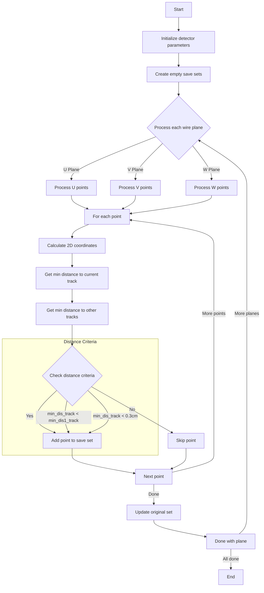

# Update Association Function Explanation

## Purpose
The `update_association` function is designed to update and filter point associations between 2D and 3D space in particle tracking. It helps ensure that points are correctly associated with the appropriate track segments by comparing distances and applying various filtering criteria.

## Function Parameters
```cpp
void update_association(
    std::set<std::pair<int,int>>& temp_2dut,  // U-time coordinates
    std::set<std::pair<int,int>>& temp_2dvt,  // V-time coordinates
    std::set<std::pair<int,int>>& temp_2dwt,  // W-time coordinates
    WCPPID::ProtoSegment* sg,                 // Current segment being processed
    WCPPID::ProtoSegmentSelection& segments   // All segments
)
```

## Main Steps

### 1. Parameter Initialization
First, the function initializes various detector parameters:
```cpp
// Get detector parameters
TPCParams& mp = Singleton<TPCParams>::Instance();
double pitch_u = mp.get_pitch_u();
double pitch_v = mp.get_pitch_v();
double pitch_w = mp.get_pitch_w();
// ... other parameters
```

### 2. Processing Points for Each Wire Plane
For each wire plane (U, V, W), the function:
1. Creates temporary sets to save valid associations
2. Processes each point in the input sets
3. Calculates distances and applies filtering criteria

Example for U plane:
```cpp
std::set<std::pair<int,int>> save_2dut;
for (auto it = temp_2dut.begin(); it!=temp_2dut.end(); it++) {
    // Convert to space point
    double x = (it->second - offset_t)/slope_x;
    double y = (it->first - offset_u)*pitch_u;
    
    // Get minimum distances
    double min_dis_track = sg->get_closest_2d_dis(x,y,0);
    double min_dis1_track = 1e9;
    
    // Check distances against other segments
    for (size_t i=0; i!=segments.size(); i++) {
        if (segments.at(i)==sg) continue;
        double temp_dis = segments.at(i)->get_closest_2d_dis(x,y,0);
        if (temp_dis < min_dis1_track)
            min_dis1_track = temp_dis;
    }
```

### 3. Point Filtering Logic
Points are kept if they meet either of these criteria:
- Closer to the current track than to any other track
- Within a very close distance (< 0.3 cm) to the current track

```cpp
if (min_dis_track < min_dis1_track || // closer to the main track
    min_dis_track < 0.3*units::cm) {
    save_2dut.insert(*it);
}
```

### 4. Final Update
After filtering, the original sets are updated with the filtered results:
```cpp
temp_2dut = save_2dut;
temp_2dvt = save_2dvt;
temp_2dwt = save_2dwt;
```

## Example Scenario

Consider a case with two crossing tracks:

```cpp
// Initial points for track 1 (U plane)
temp_2dut = {
    {100, 50}, // (wire, time)
    {101, 51},
    {102, 52}
};

// Track 1 minimum distances
min_dis_track = 0.2 cm;   // to current track
min_dis1_track = 0.8 cm;  // to other track

// Point (100,50) will be kept because:
// 0.2 cm < 0.8 cm (closer to current track)
// 0.2 cm < 0.3 cm (within close distance threshold)
```

## Filtering Visualization

```
Before Filtering:              After Filtering:
   
   Track 1  Track 2            Track 1  Track 2
      |        |                  |        |
      |      * |                  |        |
      |    *   |                  |        |
      | *      |                  |        |
      *        |                  *        |
   
* = Associated points           * = Kept points
```

## Important Notes

1. Distance Thresholds:
   - Primary threshold: 0.3 cm for immediate proximity
   - Relative comparison between tracks for points further away

2. Wire Planes:
   - Each plane (U, V, W) is processed independently
   - Same logic applied but with plane-specific parameters

3. Performance Considerations:
   - Uses efficient distance calculations
   - Early termination when clear associations are found

# Flow Diagram


The key points about this function are:

Purpose: It filters and updates point associations between 2D and 3D space to ensure accurate track reconstruction.
Core Logic: For each point, it:

Calculates distances to the current track and other tracks
Keeps points that are either:

Closer to the current track than other tracks
Very close to the current track (< 0.3 cm)


Processing:

Handles each wire plane (U, V, W) separately
Uses temporary sets to store valid points
Updates original sets at the end