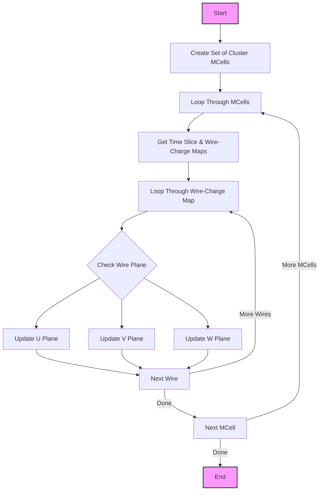

# Understanding update_data_dQ_dx_fit()

## Overview

The `update_data_dQ_dx_fit()` function is part of the Wire-Cell Toolkit's particle reconstruction system. Its primary purpose is to update charge measurements and their uncertainties for a 3D cluster's projection onto 2D wire planes.

## Function Flow


## Key Components

1. **Input Maps**:
   - `global_wc_map`: Maps time slices to wire-cell associations
   - `map_2D_ut_charge`: U plane charge measurements
   - `map_2D_vt_charge`: V plane charge measurements  
   - `map_2D_wt_charge`: W plane charge measurements

2. **Data Structures Used**:
   - `SlimMergeGeomCell`: Represents merged geometry cells
   - `WireChargeMap`: Maps wires to their charge measurements
   - `GeomWire`: Represents individual detector wires

## Code Example

Here's a simplified example showing how the function processes charge measurements:

```cpp
// Create set of cluster cells
std::set<SlimMergeGeomCell*> cluster_mcells_set;
for (auto mcell : mcells) {
    cluster_mcells_set.insert(mcell);
}

// Process each merged cell
for (auto mcell : mcells) {
    int time_slice = mcell->GetTimeSlice();
    
    // Get wire-charge maps
    WireChargeMap& wire_charge_map = mcell->get_wirecharge_map();
    WireChargeMap& wire_charge_err_map = mcell->get_wirechargeerr_map();
    
    // Process each wire
    for (auto wire_charge : wire_charge_map) {
        const GeomWire* wire = wire_charge.first;
        double charge = wire_charge.second;
        double charge_err = wire_charge_err_map[wire];

        // Update charge error if needed
        if (charge > 0 && has_multiple_cells(wire, time_slice)) {
            charge_err = 8000; // Increased uncertainty for overlapping cells
        }

        // Update appropriate plane map
        switch(wire->iplane()) {
            case 0: // U plane
                update_charge_map(map_2D_ut_charge, wire, time_slice, 
                                charge, charge_err);
                break;
            case 1: // V plane
                update_charge_map(map_2D_vt_charge, wire, time_slice,
                                charge, charge_err);
                break;
            case 2: // W plane
                update_charge_map(map_2D_wt_charge, wire, time_slice,
                                charge, charge_err);
                break;
        }
    }
}
```

## Main Logic Steps

1. **Initialize Cluster Cell Set**
   - Creates a set of all merged geometry cells in the cluster
   - Used to check cell associations later

2. **Process Each Merged Cell**
   - Gets the time slice for the cell
   - Retrieves wire charge and error maps

3. **Wire Processing**
   - For each wire with charge:
     - Gets base charge and uncertainty values
     - Checks for overlapping cells
     - Updates uncertainty if needed (8000 for overlapping cases)

4. **Plane Map Updates**
   - Updates appropriate 2D charge map based on wire plane (U, V, or W)
   - Preserves existing flags while updating charge values

## Called Functions

The function relies on these key methods:

1. `GetTimeSlice()` - From SlimMergeGeomCell
   - Returns time slice index for the cell

2. `get_wirecharge_map()` - From SlimMergeGeomCell
   - Returns map of wires to charge values

3. `get_wirechargeerr_map()` - From SlimMergeGeomCell
   - Returns map of wires to charge uncertainties

4. `iplane()` - From GeomWire
   - Returns wire plane index (0=U, 1=V, 2=W)

## Key Considerations

1. **Uncertainty Handling**
   - Base uncertainties come from wire charge error map
   - Increased uncertainty (8000) for overlapping cells
   - Preserves existing measurement flags

2. **Map Organization**
   - U plane: Direct wire index
   - V plane: Wire index + 2400
   - W plane: Wire index + 4800

3. **Error Checking**
   - Verifies map entries exist
   - Reports mismatches for missing entries

## Usage Example

```cpp
// Create required maps
std::map<int, std::map<const GeomWire*, SMGCSelection>> global_wc_map;
std::map<std::pair<int,int>, std::tuple<double,double,int>> map_2D_ut_charge;
std::map<std::pair<int,int>, std::tuple<double,double,int>> map_2D_vt_charge;
std::map<std::pair<int,int>, std::tuple<double,double,int>> map_2D_wt_charge;

// Update charge measurements
pr3d_cluster.update_data_dQ_dx_fit(
    global_wc_map,
    map_2D_ut_charge,
    map_2D_vt_charge,
    map_2D_wt_charge
);
```